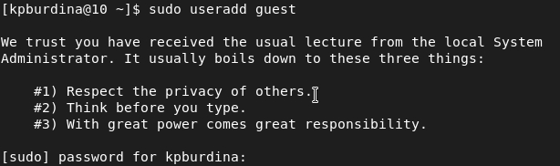
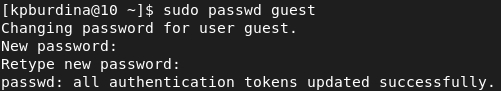
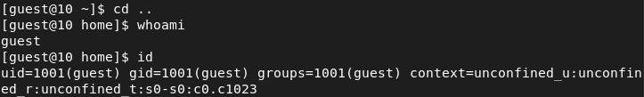
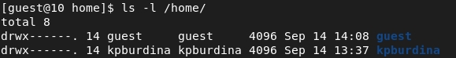
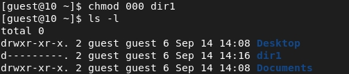
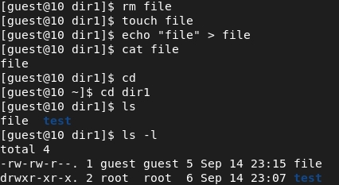
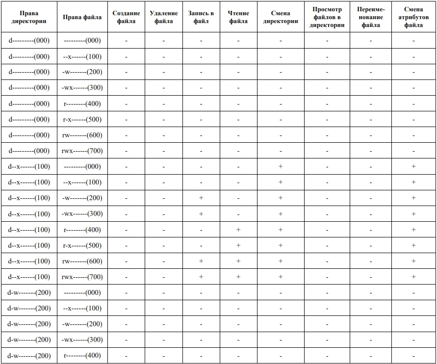
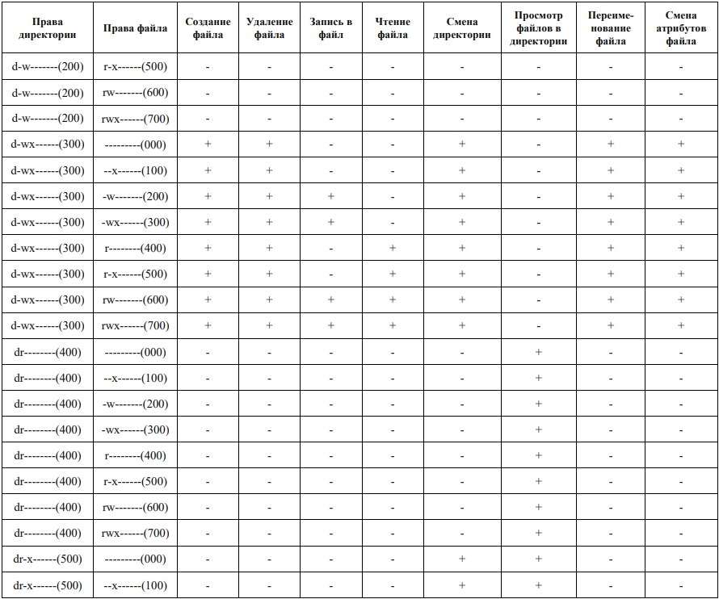
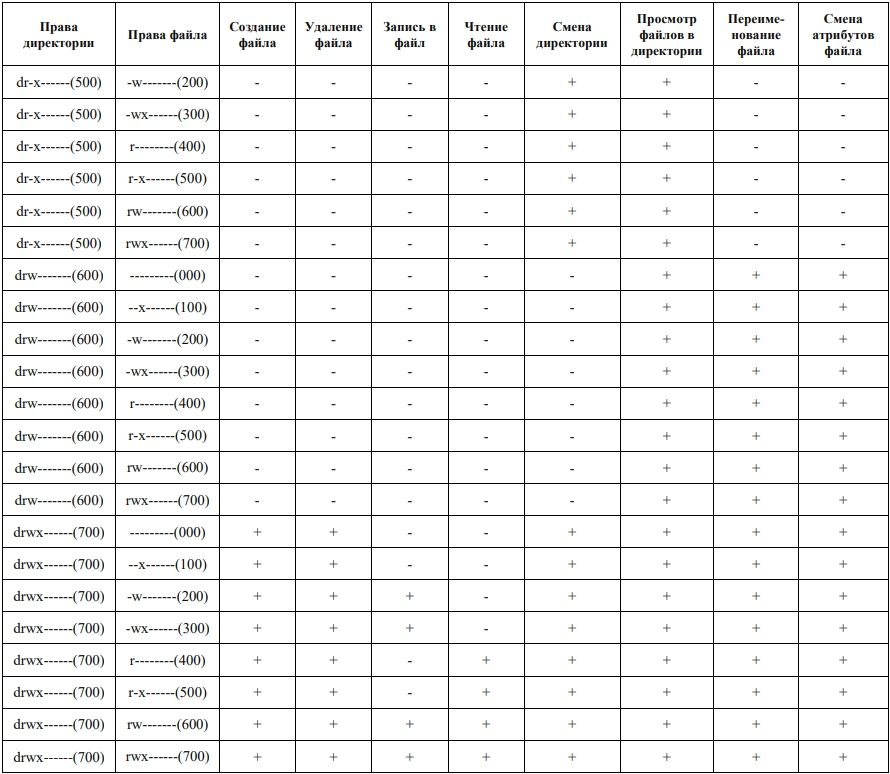
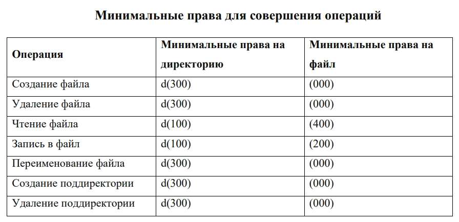

---
# Front matter
lang: ru-RU
title: Защита лабораторной работы №2. Дискреционное разгарничение прав в Linux. Основныет атрибуты 
author: "Бурдина Ксения Павловна"
group: NFIbd-01-19
institute: RUDN University, Moscow, Russian Federation
date: 2022 Sep 15th

# Formatting
toc: false
slide_level: 2
header-includes: 
 - \metroset{progressbar=frametitle,sectionpage=progressbar,numbering=fraction}
 - '\makeatletter'
 - '\beamer@ignorenonframefalse'
 - '\makeatother'
aspectratio: 43
section-titles: true
theme: metropolis

---

# Результат выполнения лабораторной работы №2

# Цель выполнения лабораторной работы 

## Цель выполнения лабораторной работы

Получение практических навыков работы в консоли с атрибутами файлов, закрепление теоретических основ дискреционного разграничения доступа в современных системах с открытым кодом на базе ОС Linux.

# Результат выполнения лабораторной работы

## Результат выполнения лабораторной работы

Создание учётной записи пользователя guest:

{width=60%}
{width=60%}

## Результат выполнения лабораторной работы

Проверка данных пользователя guest:

{width=90%}

## Результат выполнения лабораторной работы

Просмотр атрибутов директорий системы:

{width=90%}

## Результат выполнения лабораторной работы

Создание поддиректории dir1, определение прав доступа:

{width=60%} 

## Результат выполнения лабораторной работы

Снятие с директории dir1 всех атрибутов:

{width=80%}

## Результат выполнения лабораторной работы

Действия для заполнения таблицы:

{width=70%}
{width=70%}

## Результат выполнения лабораторной работы

Общая таблица прав и разрешений:

{width=60%}

## Результат выполнения лабораторной работы

{width=60%}

## Результат выполнения лабораторной работы

{width=60%}

## Результат выполнения лабораторной работы

Минимальные права, необходимые для совершения каждой из операций:

{width=80%}

# Выводы

## Выводы

1. Получили практические навыки работы в консоли с атрибутами файлов.

2. Закрепили теоретические основы дискреционного разграничения доступа в современных системах с открытым кодом на базе ОС Linux.

3. Выполнили действия в командной строке и заполнили таблицу с результатами исследования прав на совершение операций.
