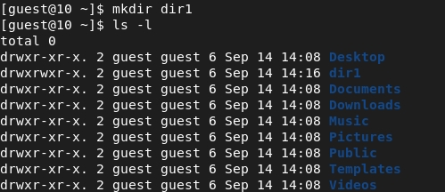
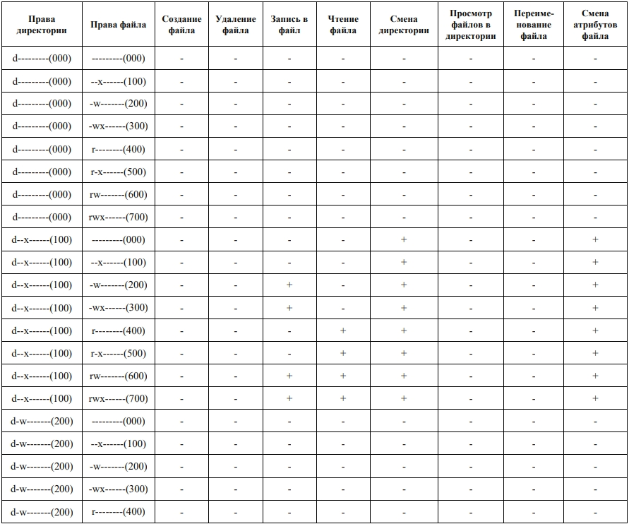
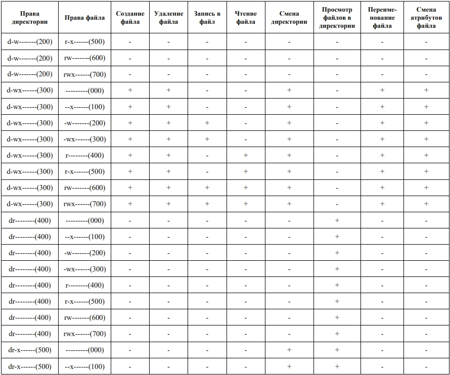
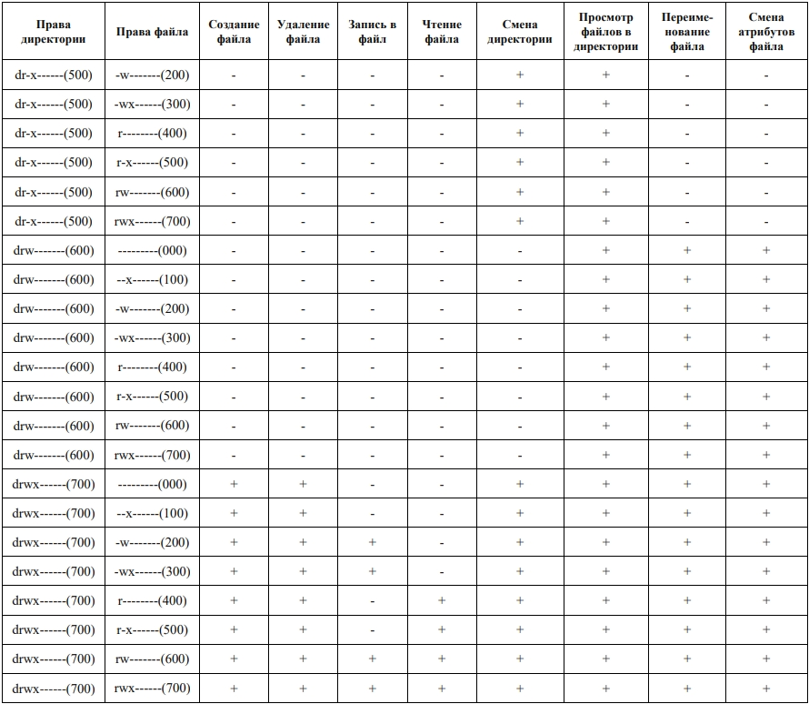
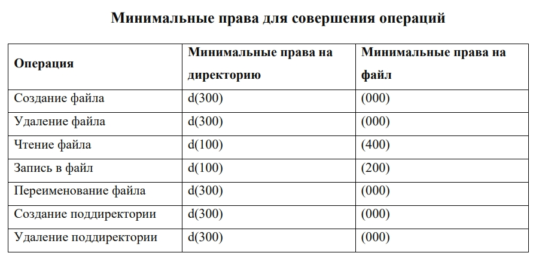

---
# Front matter
title: "Отчет по лабораторной работе №2"
subtitle: "Дискреционное разгарничение прав в Linux. Основныет атрибуты"
author: "Бурдина Ксения Павловна"
group: NFIbd-01-19
institute: RUDN University, Moscow, Russian Federation
date: 2022 Sep 15th

# Generic otions
lang: ru-RU
toc-title: "Содержание"

# Pdf output format
toc: true # Table of contents
toc_depth: 2
lof: true # List of figures
fontsize: 12pt
linestretch: 1.5
papersize: a4
documentclass: scrreprt
### Fonts
mainfont: PT Serif
romanfont: PT Serif
sansfont: PT Sans
monofont: PT Mono
mainfontoptions: Ligatures=TeX
romanfontoptions: Ligatures=TeX
sansfontoptions: Ligatures=TeX,Scale=MatchLowercase
monofontoptions: Scale=MatchLowercase,Scale=0.9
## Biblatex
biblatex: true
biblio-style: "gost-numeric"
biblatexoptions:
  - parentracker=true
  - backend=biber
  - hyperref=auto
  - language=auto
  - autolang=other*
  - citestyle=gost-numeric
## Misc options
indent: true
header-includes:
  - \linepenalty=10 # the penalty added to the badness of each line within a paragraph (no associated penalty node) Increasing the value makes tex try to have fewer lines in the paragraph.
  - \interlinepenalty=0 # value of the penalty (node) added after each line of a paragraph.
  - \hyphenpenalty=50 # the penalty for line breaking at an automatically inserted hyphen
  - \exhyphenpenalty=50 # the penalty for line breaking at an explicit hyphen
  - \binoppenalty=700 # the penalty for breaking a line at a binary operator
  - \relpenalty=500 # the penalty for breaking a line at a relation
  - \clubpenalty=150 # extra penalty for breaking after first line of a paragraph
  - \widowpenalty=150 # extra penalty for breaking before last line of a paragraph
  - \displaywidowpenalty=50 # extra penalty for breaking before last line before a display math
  - \brokenpenalty=100 # extra penalty for page breaking after a hyphenated line
  - \predisplaypenalty=10000 # penalty for breaking before a display
  - \postdisplaypenalty=0 # penalty for breaking after a display
  - \floatingpenalty = 20000 # penalty for splitting an insertion (can only be split footnote in standard LaTeX)
  - \raggedbottom # or \flushbottom
  - \usepackage{float} # keep figures where there are in the text
  - \floatplacement{figure}{H} # keep figures where there are in the text
---

# Цель работы

Целью данной работы является получение практических навыков работы в консоли с атрибутами файлов, закрепление теоретических основ дискреционного разграничения доступа в современных системах с открытым кодом на базе ОС Linux.

# Ход выполнение лабораторной работы

1. В установленной при выполнении предыдущей лабораторной работы
операционной системе создадим учётную запись пользователя guest (используя учётную запись администратора):

2. Зададим пароль для пользователя guest (используя учётную запись администратора):

3. Войдем в систему от имени пользователя guest:

{width=70%}

4. Определим директорию, в которой мы находимся, командой pwd. Сравнивая с приглашением командной строки, мы видим, что она является домашней директорией:

{width=80%}

5. Уточним имя нашего пользователя командой whoami. Увидим, что мы действительно зашли под именем guest.

6. Уточним имя нашего пользователя, его группу, а также группы, куда входит пользователь, командой id. Выведенные значения uid, gid и groups принимают значение 1001, запомним его:

Сравним вывод id с выводом команды groups:

{width=80%}

7. Сравнивая полученную информацию об имени пользователя с данными, выводимыми в приглашении командной строки, видим, что они совпадают.

8. Просмотрим файл /etc/passwd:

Найдем в нём свою учётную запись. Она у нас находится в самом конце. Видим, что uid пользователя и gid пользователя совпадают со значениями, найденными в предыдущих пунктах.

Мы также можем получить вывод команды с помощью программы grep в качестве фильтра для вывода только строк, содержащих определённые буквенные сочетания. Такой вывод будет выглядеть следующим образом:

9. Определим существующие в системе директории:

У нас имеются поддиректории наших учетных записей. Видим, что у обоих пользователей установлены права на чтение, изменение и выполнение только для самого пользователя.

10. Проверим, какие расширенные атрибуты установлены на поддиректориях, находящихся в директории /home:

Можем увидеть, что расширенные атрибуты у директории отсутствуют. Также видно, что на  недоступен просмотр расширенных атрибутов директорий других
пользователей.

11. Создадим в домашней директории поддиректорию dir1 и определим командами ls -l и lsattr, какие права доступа и расширенные атрибуты были выставлены на директорию dir1:

{width=90%}

Видим, что у нас в созданной поддиректории имеются права на чтение, исполнение и редактирование у пользователя и группы, а у остальных только на чтение и исполнение.

При этом видим, что доступа к расширенным атрибутам у нас нет.

12. Снимем с директории dir1 все атрибуты командой chmod 000 dir1 и проверим правильность выполнения команды:

13. Попытаемся создать в директории dir1 файл file1, однако получим отказ в выполнении операции по созданию файла, так как мы сбросили права на исполнение директории dir1. С помощью команды $ls -l /home/guest/dir1$ убедились, что файл file1 не находится внутри директории dir1:

14. Заполним таблицу «Установленные права и разрешённые действия», выполняя действия от имени владельца директории (файлов), определив опытным путём, какие операции разрешены, а какие нет (https://esystem.rudn.ru/pluginfile.php/1651883/mod_resource/content/6/002-lab_discret_attr.pdf)[1].

Мы рассматриваем первые три атрибута, которые относятся к владельцу. Это 64 варианта. 

Проведем действия с атрибутами директории 700 и атрибутами файла с 000 до 700.

Нам требуется для каждого возможного варианта проверить, будет ли выполняться создание и удаление файла, запись в файл, его чтение, смена директории, просмотр файлов в директории, возможно ли будет переименовывать файл, а также изменять его атрибуты.

Установим атрибуты директории dir1 как 700:

{width=80%}

{width=80%}

По умолчанию у нас атрибуты созданного файла были 700. Мы видим, что у нас возможны все действия с файлом, просмотр и изменение атрибутов, смена директории, а также просмотр файлов в ней. Занесем эти данные в таблицу.

Теперь изменим атрибуты файла на 000 и проведем все действия с ними:

У нас нет никаких прав на работу с файлом, поэтому мы можем создать новый файл, удалить файл и поработать с директорией, в которой у нас есть все права: сменить, просмотреть содержимое, переименовать файлы, сменить атрибуты файлам.

Изменим атрибуты файла на 100:

Видим, что у нас появилась возможность на исполнение файла, но мы по прежнему не смодем записать в него данные или прочитать.

Изменим атрибуты файла на 200:

Теперь мы имеем право сделать запись в файл, поскольку появилась возможность редактирования файла, но по прежнему нет права на чтение.

Изменим атрибуты на 300:

У нас также имеется возможность исполнения файла и редактирования.

Изменим атрибуты на 400:

Теперь у нас есть право на чтение файла, но нет возможности редактирования.

Посмотрим возможности работы с атрибутами файла 500:

Мы можем исполнять и читать файл, однако у нас нет права на редактирование.

Завершим просмотр директории dir1 с атрибутами 700 просмотром возможностей файла с атрибутами 600:

Видим, что мы можем и прочитать файл, и изменить его. Нет права лишь на исполнение.

По аналогии проведем действия с другими атрибутами директории dir1 (от 000 до 600). По итогам заполним общую таблицу. Она выглядит следующим образом:

{width=80%}

{width=80%}

{width=80%}

Проанализировав данную таблицу, можем увидеть минимальные права, которые необходимы для совершения каждой из операций. Занесем данные наблюдения в таблицу:

# Выводы

В ходе работы мы получили практические навыки работы в консоли с атрибутами файлов, закрепили теоретические основы дискреционного разграничения доступа в современных системах с открытым кодом на базе ОС Linux.

# Список литературы

1. Методические материалы курса (https://esystem.rudn.ru/pluginfile.php/1651883/mod_resource/content/6/002-lab_discret_attr.pdf)

